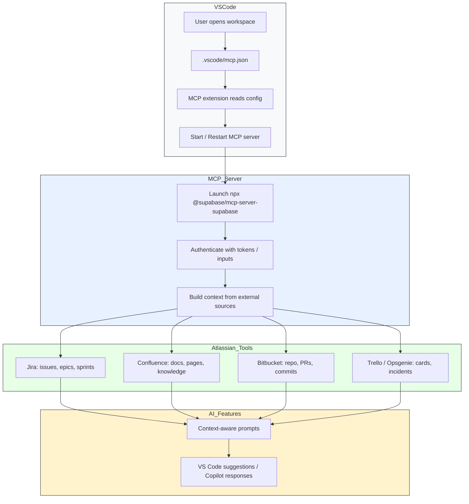

# Atlassian MCP Process Overview

This document explains the Model Context Protocol (MCP) workflow in the context of Atlassian tooling, showing how VS Code, MCP configuration, the MCP server, and Atlassian applications work together.

## Mermaid Diagram

## Workflow Details

1. **Workspace startup**
   - The developer opens the `kt-session-fe` workspace in VS Code.
   - The MCP extension looks for an `.vscode/mcp.json` file in the workspace root.

2. **MCP configuration**
   - `mcp.json` declares one or more MCP server definitions and input prompts.
   - In this repository, the server configuration includes a `supabase` HTTP endpoint and a `com.supabase/mcp` stdio launcher.
   - The stdio launcher uses `npx` to run `@supabase/mcp-server-supabase@0.8.2`.

3. **Starting the MCP server**
   - When the user triggers start/restart, the MCP extension launches the configured server command.
   - The server receives environment inputs such as `SUPABASE_ACCESS_TOKEN` and other prompt values.
   - The server initializes, connects to the external backend, and registers available features.

4. **Context collection**
   - Once running, the MCP server gathers contextual data from connected services.
   - For Atlassian workflows, this may include:
     - Jira issue details, board state, epics and sprint information
     - Confluence pages and team documentation
     - Bitbucket repository metadata, pull requests, and commit history
     - Trello boards or Opsgenie alerts if used in the same Atlassian ecosystem

5. **Context delivery**
   - The MCP server supplies this context to the VS Code extension and any connected AI agents.
   - The AI features use the combined context to generate smarter responses, code suggestions, and documentation lookups.

6. **User interaction**
   - Developers interact with the AI-powered tooling inside VS Code.
   - The context-aware assistant can answer questions like:
     - "What is the current sprint goal?"
     - "Which Jira issue is assigned to this component?"
     - "Show me the Confluence design doc for this feature."

## Example MCP Configuration Flow

- `mcp.json` defines server details and inputs
- VS Code uses those definitions to render controls
- The MCP extension starts the server
- The server uses Atlassian tokens or APIs to fetch context
- AI tools consume the context and provide responses

## Notes

- If the `Start` / `Restart` button is missing, the MCP extension may not detect the workspace or may not support the current config.
- Make sure the file is present in the root workspace and that the MCP extension is active.
- Atlassian integration typically requires API credentials or tokens for Jira, Confluence, Bitbucket, and other products.
